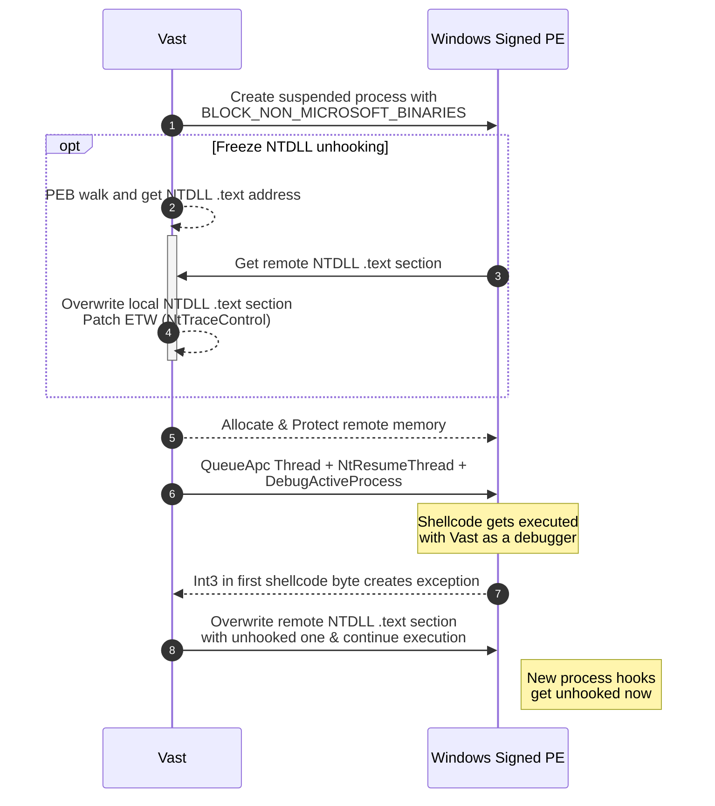

# vast

Shellcode loader using Freeze for NTDLL unhooking and EarlyBird APC Queue for shellcode execution. The new process gets then unhooked by remotely overwritting its old NTDLL .text section (_Frozen regression_).

